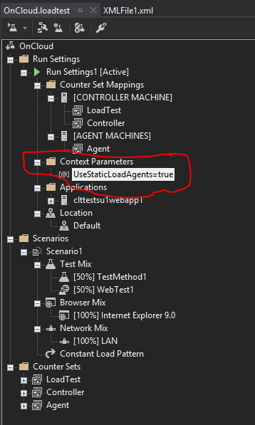
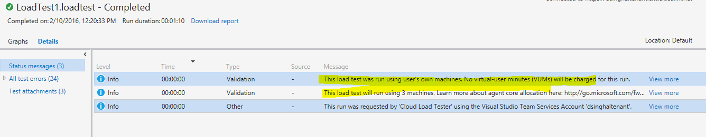

# User guide for doing load testing with CLT

##How to queue a run on self-provisioned VMs
One needs to add the following context parameter in the load test to route the run on local/static agents.

        Parameter name – UseStaticLoadAgents
        Parameter value – true
		

The core count provided in the load test (through run settings) will be treated as the number of machines in case of self-provisioned agents scenario.

When the run is queued against user’s pool, the status message section for the run will have the clear indication of this.

